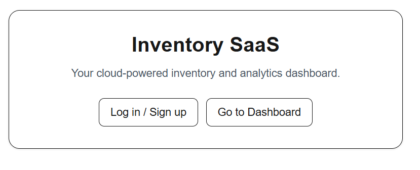
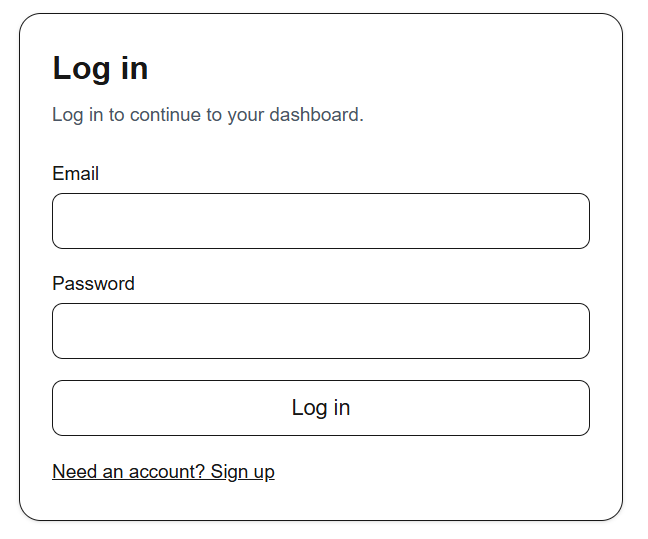
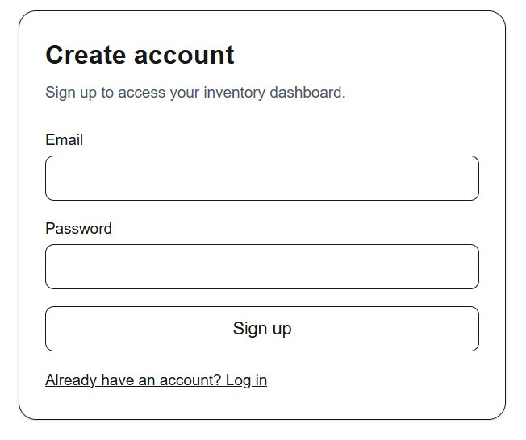
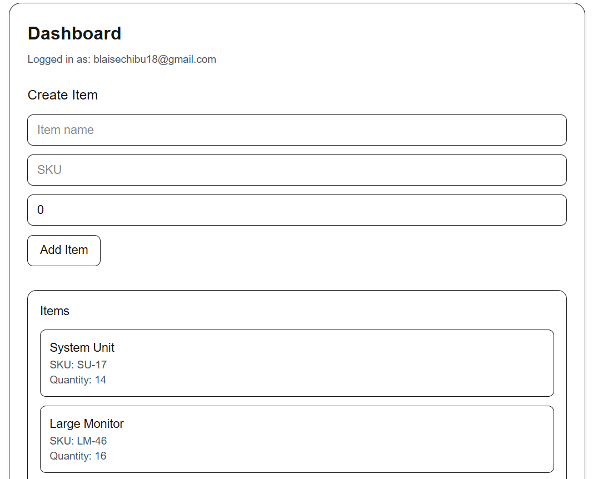

# Inventory SaaS Platform

A full-stack multi-tenant inventory management platform built with Next.js, TypeScript, AWS Lambda, PostgreSQL, and Supabase.

The project was designed to demonstrate modern full-stack architecture, serverless deployment, authentication, CI/CD pipelines, automated testing, and production-ready infrastructure.

---

## Live Demo

Frontend: https://inventory-saas-web.vercel.app

Repository: https://github.com/Agbak17/inventory-saas

---

## Screenshots

### Landing Page



### Authentication





### Dashboard



---

## Local Development Setup

### Clone Repository

```bash
git clone https://github.com/Agbak17/inventory-saas.git
cd inventory-saas
```

### Install Dependencies

```bash
npm install
```

---

## Environment Variables

Create a `.env.local` file inside `apps/api`:

```env
SUPABASE_URL=your_supabase_url
SUPABASE_SERVICE_ROLE_KEY=your_service_role_key
```

Create a `.env.local` file inside `apps/web`:

```env
NEXT_PUBLIC_API_URL=your_api_url
NEXT_PUBLIC_SUPABASE_URL=your_supabase_url
NEXT_PUBLIC_SUPABASE_ANON_KEY=your_supabase_anon_key
```

---

## Run Frontend

```bash
cd apps/web
npm run dev
```

---

## Run Backend API

```bash
cd apps/api
npm run dev
```

---

## Run Tests

```bash
npm test
```

---

## Features

- Multi-tenant inventory management
- Secure authentication and authorization
- Serverless backend architecture
- RESTful API design
- Inventory analytics dashboard
- Automated integration testing
- CI/CD with GitHub Actions
- PostgreSQL relational database integration

---

## Tech Stack

### Frontend
- Next.js
- React
- TypeScript

### Backend
- Node.js
- Hono
- AWS Lambda
- API Gateway

### Database & Authentication
- PostgreSQL
- Supabase

### Testing
- Jest
- Supertest

### DevOps & Deployment
- GitHub Actions
- AWS CDK
- Vercel

---

## Architecture

- Frontend deployed on Vercel
- Backend API deployed using AWS Lambda
- API Gateway handles HTTP routing
- Supabase provides a PostgreSQL database and authentication
- GitHub Actions used for CI/CD automation
- Monorepo structure used for frontend, backend, and infrastructure code

---

## Monorepo Structure

```txt
apps/
  web/       # Next.js frontend
  api/       # Hono API backend

infra/
  cdk/       # AWS infrastructure configuration

.github/
  workflows/ # CI/CD pipelines
```
